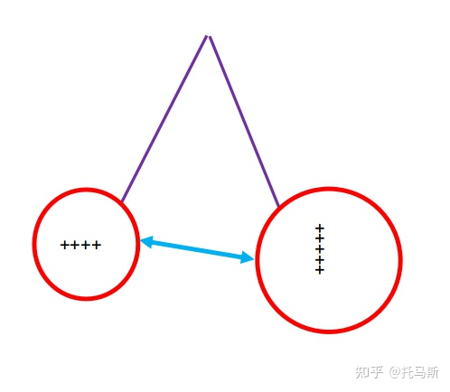
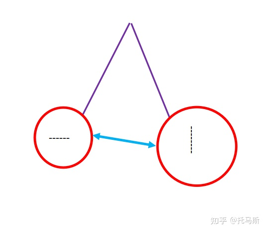
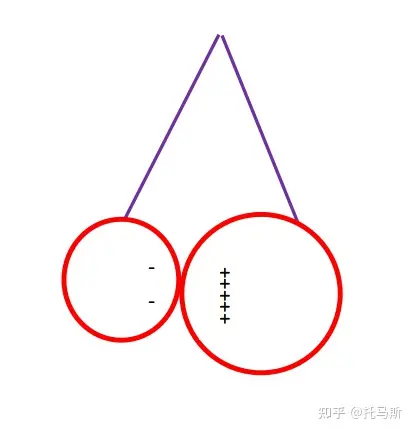
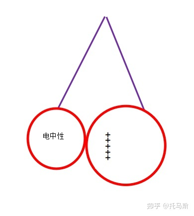
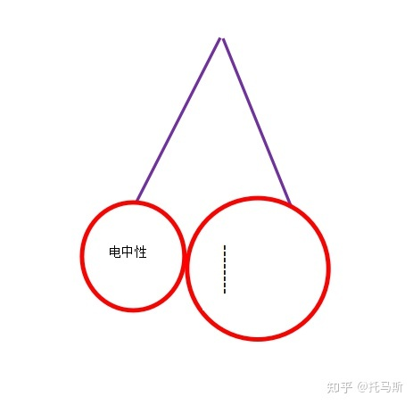
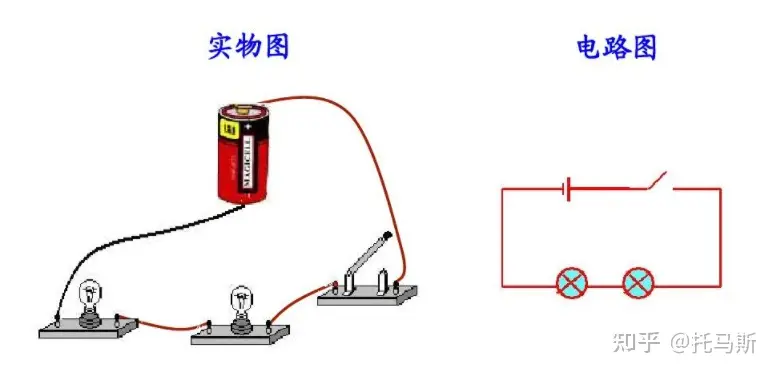
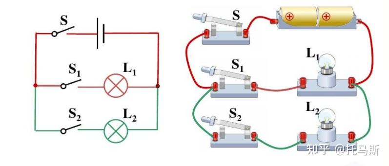

# 中学电学基本概念总结

## 一、电荷

### 基本概念

在我们所处的自然界中，只存在两种电荷，即正电荷和负电荷。我们把用丝绸摩擦过的玻璃棒所带的电荷称为正电荷，其实质是在摩擦过程中失去了电子；用毛皮摩擦过的橡胶棒所带的电荷称为负电荷，其实质是在摩擦的过程中得到了电子。

### 基本性质

电荷的性质主要有以下几点：

1. 带电体具有吸引轻小物体的性质。现象说明：摩擦过头发的刻度尺可以吸引碎纸屑。
2. 同种电荷相互排斥，异种电荷相互吸引。就像磁铁一样，同种电荷（正正负负）的相互作用是排斥，异种电荷（正负）的相互作用是吸引。
3. 带电体可以吸引呈电中性的物体，无论该带电体带何种电荷。

示意图如下：

关于电荷更详细的内容，参考本篇[文章](https://zhuanlan.zhihu.com/p/386100047)。

## 二、电流

我们在认识电流时是以水流作类比的。用水流类比电流，我们认为在导线中也有类似于水流的东西，于是把导线中的这种东西称为电流。

电流的形成原因是导体中电荷的定向移动。这里电荷的种类没有作特别说明，意指正负电荷均可。

对于电流的说法，我们习惯上称之为电路中的电流或流经导体的电流。例如：流经灯泡的电流等。

### 基本单位

电流的单位为安培。用英文大写字母 A 来表示；电流本身用大写字母 I 来表示。例如：

I = 1A，表示电流为 1 安。

### 基本性质

关于电流的性质，我们要分情况来讨论。根据电路的类型不同，电流的性质是不同的。

1. 对于串联电路来说，电流处处相等。可以简记为一句话：串联电路的电流处处相等。用数学表达式为：

$I=I_1=I_2=I_3=...=I_N$

2. 对于并联电路来说，干路电流等于各支路电流之和。由于并联电路可以看作是由若干个串联电路组合而成的，因此并联电路是比串联电路更复杂的电路，其电流变化与串联电路也是不同的，我们可以简记为并联电流的总电流（干路电流）是各支路电流之和。用数学表达式表达为：

$I=I_1+I_2+....+I_N$

### 基本测量

对于电流的测量，我们所用的是电流表（有时候又叫安培表）。在测量的时候电流表是串联接入电路，测量的是电路中的电流。电流表的表盘上有三个接线柱，一般来说，这三个接线柱为一个负接线柱、两个正接线柱，两种规格，我们在测量的时候要根据实际情况选择合适的规格。

电流表串联接入电路时要注意：电流从正接线柱流入，从负接线柱流出。

关于电流的更详细的内容，参看[此处](https://zhuanlan.zhihu.com/p/404330451)。

## 三、电路

### 基本概念

把电源、导线、开关（电键）、用电器等电学元件按照一定规则连接起来，就组成了电路。任何一个电路，必不可少的最基本的电学元件为以下四种：电源、导线、开关、用电器，而且这四种元件在电路中的作用各不相同：电源为整个电路提供电能；导线连接整个电路，或者说为电流的流动提供通道；开关——控制整个电路；用电器——消耗电能，或者说把电能转化为其他形式的能从而达到我们的使用目的。

### 基本种类

我们在中学阶段所接触的电路分为两类，串联电路和并联电路。

1. 串联电路

就是将电路中各个电学原件依次连接在一起，从而组成的完整的电路。串联电路的示意图如下所示：

2. 并联电路

并联电路中的并联可以理解为平行的意思。也就是说，电路中的某些用电器平行的连接到电路中。在并联电路中，电流有两条或多条路径，所以并联电路也可以看作是由若干个串联电路组成的。

并联电路分为干路和支路。在并联电路中，电流从电源的正极出发，经过干路后分支，然后电流流经每条支路，最后汇合到干路，流向电源的负极。

并联电路的示意图如下图所示：

### 基本状态

电路可以分为三种状态，即通路、开路（断路）、短路。

通路：处处连通的电路。此时，电路中的所有电学元件都没有故障，电路能够正常工作。

开路（断路）：是指电路中的某一处断开，此时电路中没有电流，用电器无法正常工作，属于故障电路。

短路：是指电路中的电流过大，烧坏电路的现象。短路是非常危险的，特别容易发生火宅，一般不会允许电路短路的发生，属于故障电路。

关于电路的详细内容，参看[此处](https://zhuanlan.zhihu.com/p/404330856)。

## 四、电压

